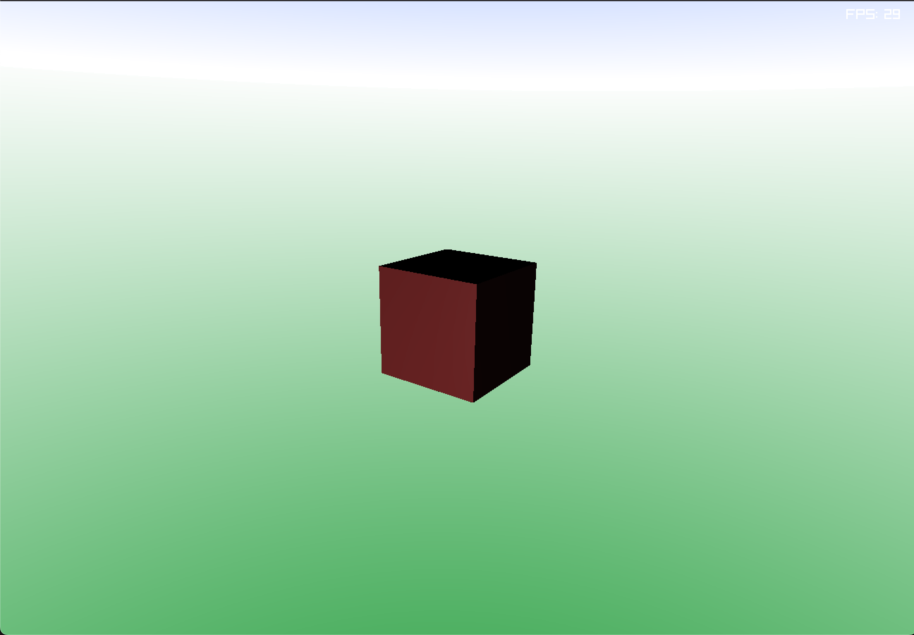
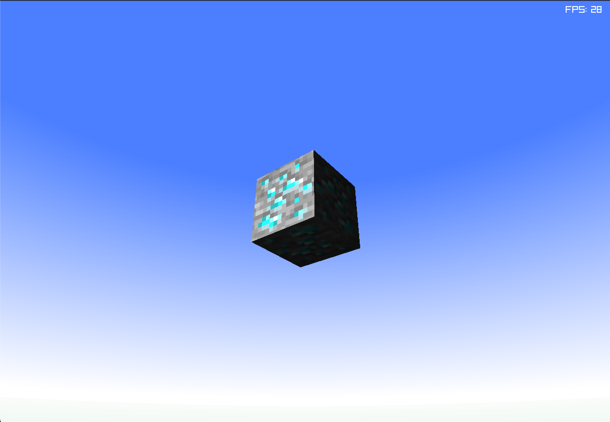
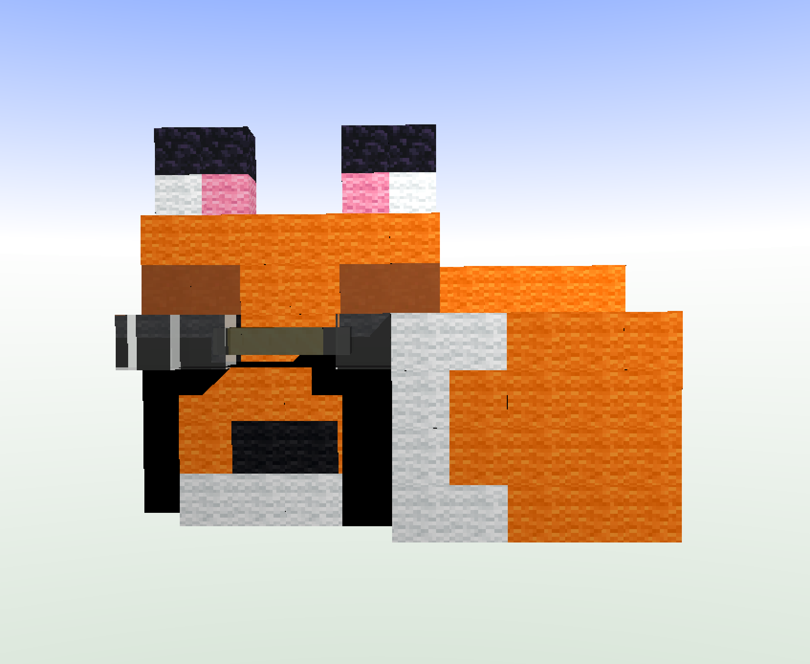
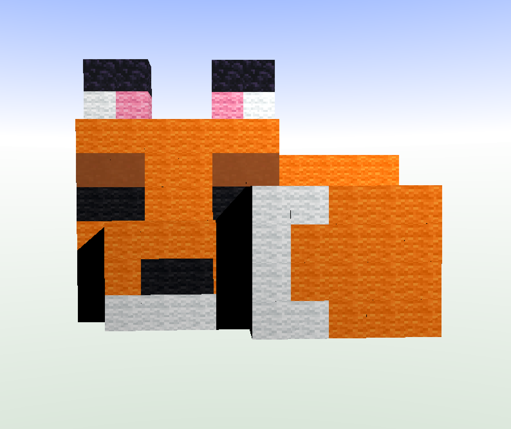

# Diorama
The diorama is a sleeping minecraft fox with glasses.
In total there where 5 types of blocks used:
- Wool
- Obsidian
- Clay
- Glass
- Gold

## YouTube Video of the Diorama
- URL: https://youtu.be/VBd6UABuF-0

## Controls
- Esc or Q to Quit
- Arrow Keys to Rotate the Camera
- O and P to Zoom In and Out

## ScreenShots

#### Normal Cube

#### Textured Cube

#### Diorama With Glasses

#### Diorama Without Glasses
